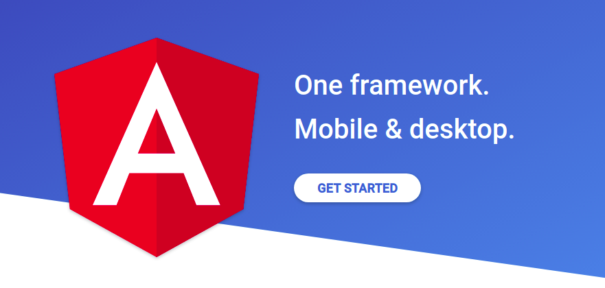

# Angular

Angular is an app-design framework and development platform for creating efficient and sophisticated single-page apps.

Learn one way to build applications with Angular and reuse your code and abilities to build apps for any deployment target. For web, mobile web, native mobile and native desktop.

https://angular.io/

# Angular8-Course

Everything you need to know about Angular 8+ using TypeScript and good practices offered by the angular team.

Some of the technologies used in this course:

- Firebase   

- Firebase RESTful services

- Firebase Cloud Functions

- CRUD

- TypeScript   

- ECMAScript 6   

- Reactive-Extensions   

- Sockets   

- Ionic 5

- Atom packages / Visual Studio Code Extensiones 

- Angular CLI

- AngularFire

- Local Storage

- Bootstrap 4

- Spotify API

- Youtube API

- Other Technologies

### Section1-Introduction
Minimum installations and configurations necessary

### Section2
Introduction to TypeScript and ES6

### Section3
TemplateUrl, Bootstrap 4, Structural Directives NgIf-NgFor

### Section4
SPA, Angular CLI, Angular Router, RouterLink, RouterLinkActive, ActivatedRoute

### Section5
Angular Pipes: uppercase, lowercase, slice, decimal, percent, currency, json, async, date and custom pipe

### Section6
Spotify API and HttpClient, RxJS Operators in Angular, Observable: Error Handling

### Section7
Ionic Framework 5, Alert Controller, LocalStorage

### Section8
Directives: ngStyle, ngClass, ngSwitch. Child routes

### Section9
Angular CanActivate, ActivatedRouteSnapshot, RouterStateSnapshot, UrlTree and Use of Auth0 API

https://auth0.com/

### Section10
Example of Login and Logout with Angular HttpClient, Firebase Authentication and SweetAlert2 to show notifications to the user

### Section11
Angular Forms and Validations.

- Form Validation - Template

- Form Validation - Data

### Section12
Example of Firebase RESTful services

### Section13
AngularFire, Authentication with Google 

### Section14
Example of how use Themoviedb API

https://www.themoviedb.org/

### Section15
Google Map, but cannot tested due to license

### Section16
YouTube API and HttpClient, HttpParams

### Section17
Deploy application in production

### Section18
Useful documentation

### Section19
Firebase and Storage

### Section21
Dynamic Graphs in Angular: ng2-charts

### Section22
Angular Virtual Scroll y Drag & Drop, ViewPort

### Section23
Angular with Firestore, Firebase functions, Deployment

